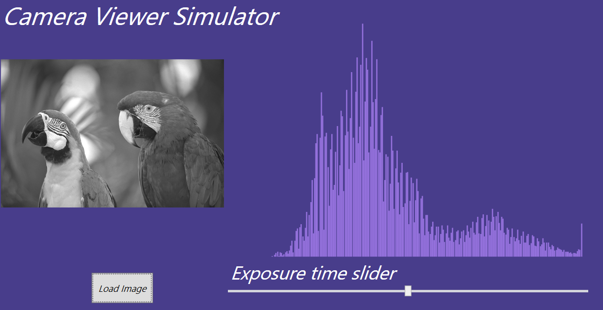

# CamaraViewerSimulator

This simulator purpose is to help a user to find the optimal exposure settings for a spesific image. It provides live histogram presentation and a slider to define the level of brightness in the image.

## Limitations
- Currently the simulator support only gray-scaled images
- If the original image is very bright or very dark - the simulator may not reach the edge of thr possible brightness

# Note
I decided to not apply MVVM structure, due to lack of familiarity and time.

# Installation and use

- git clone https://github.com/RonVentura/CameraViewerSimulator
- Open the solution file in Visual Studio
- Build the solution and run the project
- For your convenient, there are 2 images attaches to the project
